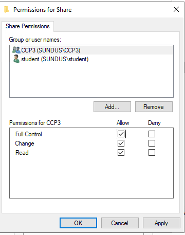

# Windows Server: Active Directory & File Sharing Configuration

## 📌 Project Overview
This project demonstrates the implementation of a centralized identity management system using **Windows Server Active Directory (AD DS)**. The lab focuses on user lifecycle management, security group organization, and the configuration of secure network resources via File Sharing permissions.

## 🛠️ Technologies Used
*   **Operating System:** Windows Server 2022 / 2019
*   **Services:** Active Directory Domain Services (AD DS)
*   **Tools:** Server Manager, AD Users and Computers, File Explorer (SMB Sharing)
*   **Environment:** Azure Lab Services

## 🚀 Key Features & Tasks

### 1. Active Directory User Provisioning
*   Created and configured administrative and standard user accounts within the domain.
*   Managed user properties including Logon Names (UPNs) and security credentials.
*   Enforced password policies (e.g., "Password never expires" for lab environment testing).

### 2. Security Group Management
*   Established **Global Security Groups** (e.g., `CCP3`) to streamline permission management.
*   Implemented nested membership by assigning multiple user objects to specific organizational groups.

### 3. Network File Sharing & NTFS Permissions
*   Created a centralized network share directory (`C:\Share`).
*   Configured **Advanced Sharing** settings to restrict access to authorized personnel only.
*   Assigned **Full Control** permissions to specific Security Groups, demonstrating the principle of least privilege and group-based access control.

## 📸 Lab Evidence

### User Creation

### Group Membership

### Permission Configuration

## 💡 Key Takeaways
*   **Scalability:** Learned how Security Groups simplify the process of managing hundreds of users.
*   **Security:** Practiced removing "Everyone" from share permissions to ensure data integrity.
*   **Network Pathing:** Verified resource availability using UNC paths (e.g., `\\Server-Name\Share`).
